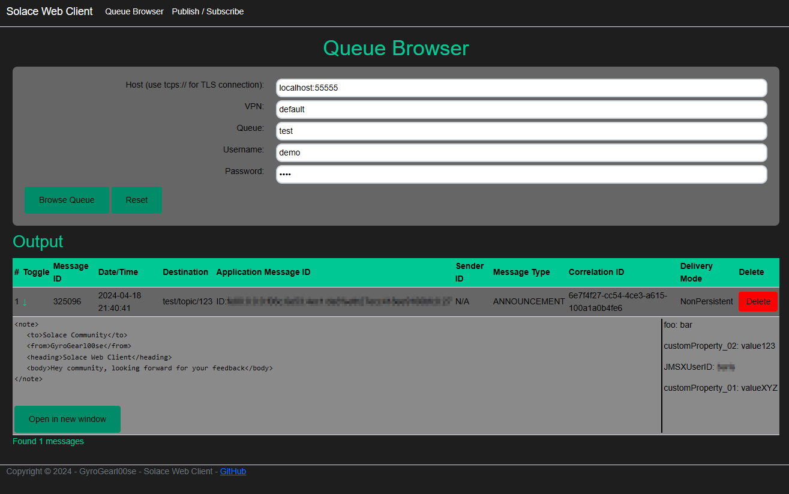

# Solace Web Client

<h1 style="color:red">ARCHIVED</h1>
<h3 style="color:red">Due to change of the used Framework (Razor -> Blazor) and complete rewrite of code, I've decided to start over with a new repo. </h3>

[GitHub - SolaceWebClient](https://github.com/GyroGearl00se/SolaceWebClient)

## Description
The Solace Web Client is using the .NET (C#) library and offers Queue browsing - (Publish/Subscribe to be implemented soon).



## Secure Connection (TLS)
To perform secure connections (tcps://) mount the certificate(s) from your desired endpoint(s) in the "/app/trustedca" directory.

## Environment Variables
|Variable|Value|Function|
|---|---|---|
|SWC_SKIP_SSL_VERIFY|true / false|skip ssl verification for tcps connections (default: false)|

### Docker

```
docker run -d -p 8080:8080 gyrogearl00se/solace-web-client:latest

For TCPS connections
docker run -d -p 8080:8080 -v $(pwd)/certs:/app/trustedca gyrogearl00se/solace-web-client:latest

For TCPS connections without certificate verification (not recommended!)
docker run -d -p 8080:8080 -e SWC_SKIP_SSL_VERIFY=true gyrogearl00se/solace-web-client:latest
```
